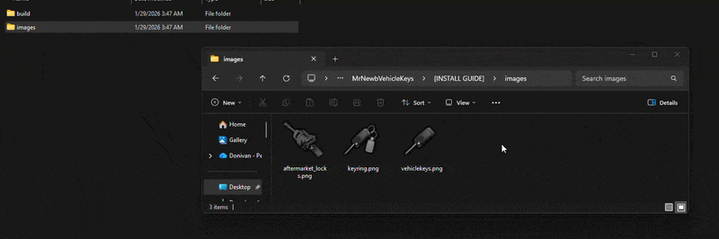
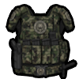
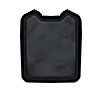
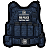
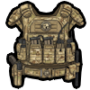
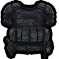

# Image Setup

Inside the resource, you'll find a folder named \[INSTALL GUIDE]. I've included an "images" folder within it, containing all the item images required for your inventory. You need to copy these images into your inventory's designated images folder (e.g., `inventory/html/images/`) to use them.

<figure><figcaption>
Open the <code>images</code> folder inside the install guide and move those files into your inventory's image directory.
</figcaption></figure>

If you've followed the steps for The Inventory and framework, the installation is complete. Enjoy your FiveM journey, and if you need any assistance, feel free to create a ticket in the Discord.

<figure><figcaption></figcaption></figure>

<figure><figcaption></figcaption></figure>

<figure><figcaption></figcaption></figure>

<figure><figcaption></figcaption></figure>

<figure><figcaption></figcaption></figure>
