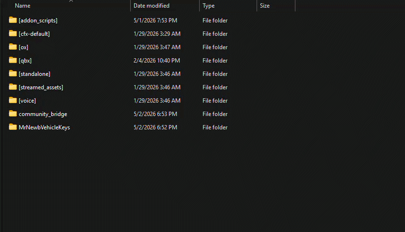

# Install

Start Order Must be after the inventory you use, ox\_lib, and community\_bridge.

This is because many scripts (including my own use autodetect to check if a resource is running)

Here is an example

```
ensure ox_lib
ensure example_famework_name
ensure example_inventory_name
ensure example_target_name
ensure community_bridge
ensure MrNewbPrescriptions
```

Please note, this is an example. Please do not put this in your config file exactly like this.


[https://github.com/MrNewb/community\_bridge](https://github.com/MrNewb/community_bridge)

<figure><figcaption><p>Example resource layout showing <code>community_bridge</code> and this script placed in your resources folder before you sort out final start order.</p></figcaption></figure>
