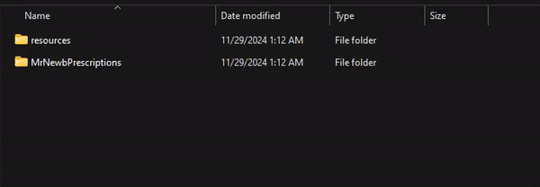

# Install

* Download the asset MrNewbPrescriptions from keymaster. ([https://keymaster.fivem.net/](https://keymaster.fivem.net/))
* Place the files into your FiveM server's **resources** folder.

<figure><figcaption></figcaption></figure>

* Add `ensure MrNewbPrescriptions` to your **server.cfg** file.
* Verify that all necessary dependencies are installed.
* Customize the config to suit your server’s requirements following the next install categories.
* Start the server and enjoy the setup!
